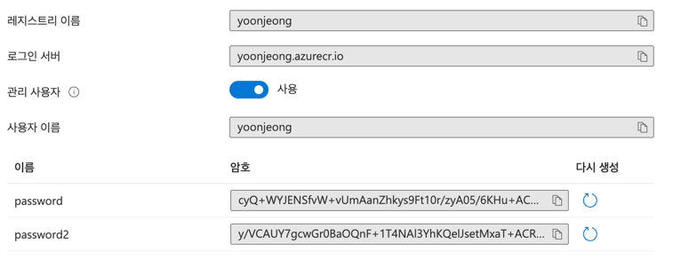

# Docker 관련 명령어

### Docker Image Build & Run Container
* `docker build -t video-streaming --file Dockerfile .`
  * DockerFile build
  * `-t`를 이용하여 이미지 이름 설정
* `docker run --env PORT=3000 -d -p 3000:3000 video-streaming`
  * `--env PORT=3000`: 컨테이너에 있는 스트리밍 앱의 포트 설정
  * `-p <host port>:<container port>`: 위에서 설정한 컨테이너 포트를 호스트 포트로 연결
* `docker stop $(docker ps -a -q);docker rm $(docker ps -a -q)`
  * 실행중인 모든 컨테니어 종료 및 삭제

### Publish Docker Image
* Private Registry - Azure
* `docker login yoonjeong.azurecr.io --username yoonjeong --password <password>`
  * 푸시할 컨테이너 레지스트리 로그인
  * 사진(리소스->컨테이너레지스트리 페이지->액세스 키)에서 서버, 사용자 이름, password(첫번째)
    
* `docker tag video-streaming yoonjeong.azurecr.io/video-streaming:latest`
  * 레지스트리에 푸시하기 위해서 이미지에 태그(`<registry url>/<image name>:<version>`) 설정
  * 해당 태그가 푸시할 이미지 및 푸시 대상인 레지스트리를 설정하는 것
* `docker push yoonjeong.azurecr.io/video-streaming:latest`
* Registry Pull Test
  * `docker rm $(docker ps -a -q)`
  * `docker rmi <id> --force`
  * `docker run --env PORT=3000 -d -p 3000:3000 yoonjeong.azurecr.io/video-streaming`